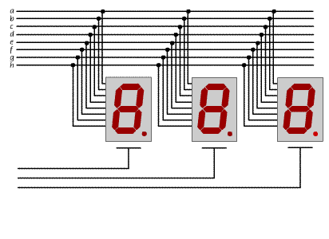

# Dynamic indication support for nanoFraework on ESP32

## Hardware
Dynamic indication is a sequential output of data to some of the indicators for a certain period of time, then output to the next group.
The circuit may be as follows:


Or it can be supplemented by a decoder (like [74141](https://datasheet.octopart.com/NTE74141-NTE-Electronics-datasheet-32009451.pdf)) to reduce the number of data lines.

## Workflow
For example, in [this](https://easyeda.com/Lolka73/Nixie_clock_hw) project NIXIE clock, 6 indicator lamps IN-14 are used, combined in 2 groups. Groups work in parallel. Each group is connected to its own decoder 155ID1 (74141).
Thus, there are 4 * 2 = 8 data lines and 3 selection lines.

All of this lones connected to ESP32 [second board](https://easyeda.com/Lolka73/Nixie_clock_lw_esp32).

Data pins:

Group 1
* IO27
* IO26
* IO25
* IO33

Group 2
* IO32
* IO5
* IO18
* IO19

Control
* IO13
* IO2
* IO14

## Example
```cs
using nanoFramework.Hardware.Esp32.DynamicIndication;

// create DynamicIndication controller
Controller c = new Controller(
    new int[] {	27, 26, 25, 33, 32, 5, 18, 19 }, // data bus pins
    new int[] {	13, 2, 14 }, // control bus pins
    4 // Data bits pre one indicator group 74141 input data bits count
);

// setup period for group switching 5ms for me is ok (no flicker)
c.UpdatePeriod_us = 5000;
// Start controller to display data on indicators
c.Enabled = true;
// setup raw data array, 1 element for 1 indicator
// it displays "01 23 45" for mac schematic
c.SetData(new uint[] { 3, 2, 4, 1, 8, 13 });

// C# process delay, indicators is working
c.Sleep(5000);
// disable indication. All indicators are shut down
c.Enabled = false;
// dispose controller. All used pins are released and resets to default state
c.Dispose();
```

## Build
1. Clone repository into any dirrectory
```
git clone https://github.com/ololoshka2871/nanoFramework.Hardware.Esp32.DynamicIndication.git
```

2. Setup nf-interpreter build environment. [Manual](http://docs.nanoframework.net/articles/getting-started-guides/build-esp32.html).

3. Copy file **Native/FindINTEROP-nanoFramework.Hardware.Esp32.DynamicIndication.cmake.template** to **nf-interpreter\CMake\Modules\FindINTEROP-nanoFramework.Hardware.Esp32.DynamicIndication.cmake**

4. Edit file **nf-interpreter\CMake\Modules\FindINTEROP-nanoFramework.Hardware.Esp32.DynamicIndication.cmake**
Replace `${PROJECT_SOURCE_DIR}/<PATH_TO_YOUR nanoFramework.Hardware.Esp32.DynamicIndication/Native folder>` to **path** to cloned repository.

5. Add string `
"NF_INTEROP_ASSEMBLIES" : [ "nanoFramework.Hardware.Esp32.DynamicIndication" ]` to in file cmake-variants.json in nf-interpreter folder

6. Build and flash nf-interpreter into ESP32

7. Add reference to **nanoFramework.Hardware.Esp32.DynamicIndication** library into your C# project.

8. Build and deploy application into ESP32

9. Enjoy!
